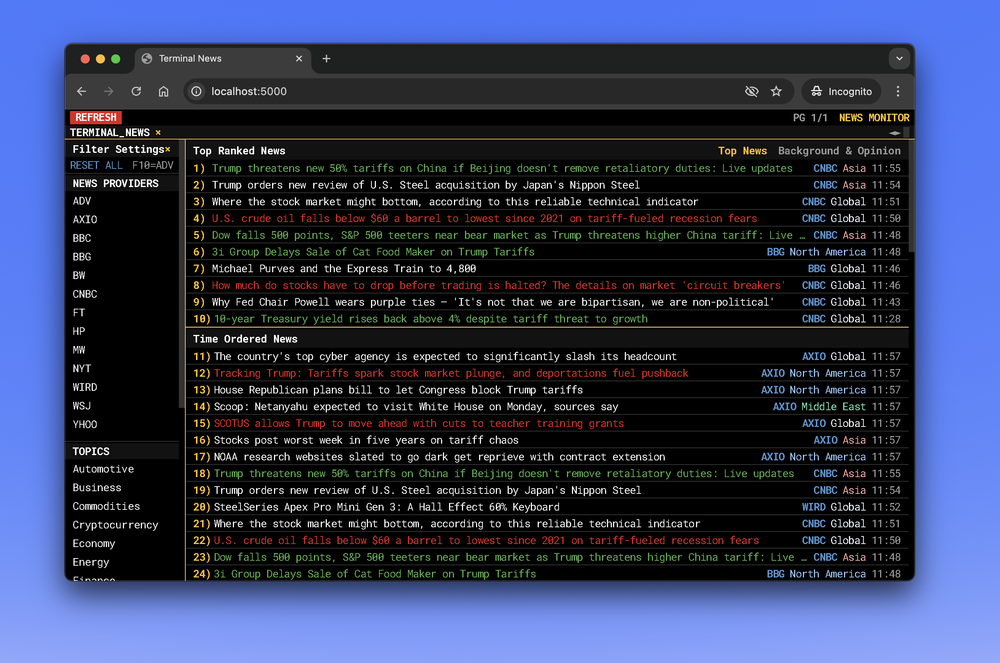

# Terminal News Application

A modern, real-time news aggregation service that collects, processes, and serves news from multiple RSS feeds with a terminal-inspired interface.


## Demo



*A terminal-inspired news reader with real-time updates, filter options, and modern UI.*

## Features

- ⚡ Real-time news aggregation from multiple trusted sources
- 🔄 Automatic news fetching every 5 minutes
- 🏷️ News categorization and ranking
- 🌎 Region-based filtering
- 📰 Provider-specific news feeds
- 🚀 REST API endpoints for news consumption
- 💻 Modern React frontend with terminal-like interface
- 📁 Memory-based storage with JSON persistence

## Tech Stack

### Backend
- **Node.js** with Express
- **TypeScript** for type safety
- **XML2JS** for RSS parsing
- **Zod** for runtime type validation
- **Natural Language Processing** for news categorization
- **In-memory storage** with JSON persistence

### Frontend
- **React 18** with hooks and functional components
- **TypeScript** for enhanced developer experience
- **Vite** for lightning-fast development and optimized builds
- **Wouter** for lightweight routing
- **TanStack Query** for efficient data fetching and caching
- **Radix UI** primitives for accessible components
- **Tailwind CSS** for utility-first styling
- **Shadcn UI** components for consistent design

## Architecture

### Backend Services

#### News Service (`server/services/newsService.ts`)
- Manages periodic news updates (5-minute intervals)
- Handles news retrieval and filtering
- Provides endpoints for:
  - Latest news
  - Top ranked news
  - News details
  - Filtered news by provider/category/region

#### RSS Service (`server/services/rssService.ts`)
- Fetches and parses RSS feeds
- Handles feed updates and new item processing
- Manages duplicate detection
- Integrates with NLP service for content analysis

#### NLP Service (`server/services/nlpService.ts`)
- Processes news items for topic extraction
- Categorizes news content
- Determines regional relevance
- Enhances news metadata

### Storage System (`server/storage.ts`)
- In-memory storage implementation
- Handles:
  - RSS feeds management
  - News items storage
  - User preferences
  - Data persistence via JSON

### API Endpoints

| Endpoint | Method | Description |
|----------|--------|-------------|
| `/api/feeds` | GET | List all RSS feeds |
| `/api/news` | GET | Get paginated news items |
| `/api/news/top` | GET | Get top ranked news |
| `/api/news/filter` | GET | Get filtered news by provider/category/region |
| `/api/news/:id` | GET | Get specific news item |
| `/api/news/refresh` | POST | Manually trigger news refresh |

## RSS Feed Providers

The application aggregates news from multiple sources including:
- Wall Street Journal (WSJ)
- Bloomberg (BBG)
- BBC News
- Yahoo News
- Axios
- USA Today
- Wired
- Local news sources

## Development

### Prerequisites
- Node.js (latest LTS version)
- npm or yarn

### Setup
1. Clone the repository
```bash
git clone https://github.com/yourusername/terminal-news.git
cd terminal-news
```

2. Install dependencies
```bash
npm install
```

### Development Commands
- `npm run dev` - Start development server
- `npm run build` - Build for production
- `npm run start` - Start production server
- `npm run check` - Type check with TypeScript

### Environment Variables
None required for basic setup. The application uses default configurations.

## Production Deployment

The application is built using Vite and can be deployed to any Node.js hosting platform:

1. Build the application:
```bash
npm run build
```

2. Start the production server:
```bash
npm run start
```

The server will run on port 5000 by default.

## Architecture Decisions

1. **In-Memory Storage**: Chosen for simplicity and speed. Data is persisted to JSON files for durability.
2. **5-Minute Update Interval**: Balances freshness with server load.
3. **Unified API/Client Port**: Both API and client are served on port 5000 for simplified deployment.
4. **TypeScript**: Used throughout for type safety and better developer experience.
5. **Modern React Patterns**: Implements latest React practices with hooks and functional components.

## Contributing

1. Fork the repository
2. Create your feature branch
3. Commit your changes
4. Push to the branch
5. Create a new Pull Request

## License

MIT 